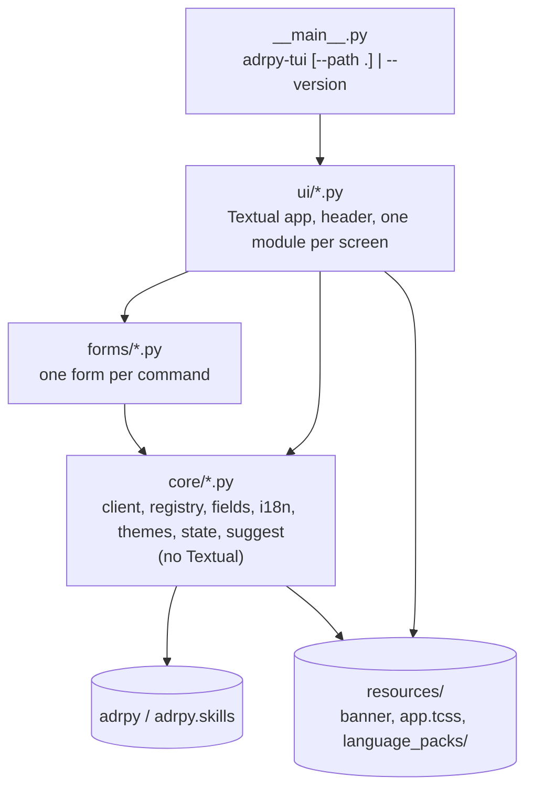

[← README](../README.md) · [Screens and forms](forms.md) · **Architecture** · [Manual test checklist](manual-test-checklist.md) · [Decisions](adr/)

# Architecture

This page explains how `adrpy-tui` is put together and why. For how it
looks and behaves, and which component edits which flag, see
[Screens and forms](forms.md); for the recorded decisions behind the
choices below, see [`doc/adr/`](adr/).

## Why this project exists

[`adrpy-ai`](https://github.com/FRACerqueira/adrpy-ai) is a JSON-only ADR
lifecycle CLI with no wizard, by design: every command is driven by flags
so it is safe to script and safe for an AI agent to call. `adrpy-tui` is
the missing human-friendly layer on top of it: a guided terminal UI that
**runs every change through the adrpy CLI** and never reimplements a rule.

## Boundaries

1. **The CLI is the only way in.** Every read and every change is an
   `adrpy` (or `adrpy-skills`) invocation whose stdout JSON is parsed. The
   TUI never writes a decision file, a config file or a decision-log entry
   itself. Reading a decision's `.md` to display it is allowed.
2. **Decide on `code` and `data`, never on `detail`.** `detail` is shown to
   the person; it is never parsed. The CLI's failure code is always the
   final word, even where the TUI pre-validates a field for convenience.
3. **One call at a time.** Calls run in a Textual worker so the UI stays
   responsive, but never two at once -- adrpy's own single-owner model
   (adrpy-ai ADR001V01) applies to the TUI as well.
4. **Decide on canonical status, display the repository's labels.**
   `explore` reports status canonically (`Proposed`, `Accepted`,
   `Rejected`, `Superseded`) whatever labels the repository configures
   (adrpy-ai ADR004V02's hidden marker); eligibility compares against those
   canonical values, and the labels read from `adrpy config` (`statusnew`,
   `statusacc`, ...) are used for display only.

## Invocation

`adrpy-ai` is a declared dependency, invoked from the TUI's own interpreter
so the TUI always talks to the adrpy installed next to it:

```
[sys.executable, "-P", "-m", "adrpy",        <verb>, *flags]
[sys.executable, "-P", "-m", "adrpy.skills", <verb>, *flags]
```

`-P` keeps the current folder off the module path: without it, a
repository holding an `adrpy/` folder would run instead of the installed
adrpy. For the same reason an empty or relative `PYTHONPATH` entry, which
names the current folder again, is dropped from adrpy's environment. Every call returns a `Result`, never raises: a read is stopped
after `READ_TIMEOUT`, a write never is -- the person may leave it and adrpy
goes on to its end, and no other write starts while it runs -- and an adrpy
that cannot be started is a failure like any other (ADR006V02). Waiting for
the one-call lock ends as well when the person leaves, and `shutdown()`,
called whenever the app closes -- a crash included (`on_unmount`) -- stops a
read in flight and leaves a write, whose output is then read to its end and
dropped (on POSIX a full pipe would block it). A call that never started
ends `NOT_STARTED`, a read stopped because the TUI quits `STOPPED`.

It is required as `adrpy-ai>=0.1.dev0,<0.2`, the series adrpy-tui was
validated against, development builds included. An adrpy-ai installed
apart from the TUI later can be outside it; `core/versions.py` compares the
installed version with the same range, read from adrpy-tui's installed
metadata, and the main menu names both when they disagree -- a warning,
not a refusal (ADR003V01).

`adrpy-ai` is not on PyPI yet, so `adrpy-tui` cannot be published either
until it is; CI installs `adrpy-ai` from git first.

## Module map

The layout follows adrpy-ai's: a thin entry point, one module per command,
and shared modules in `core/` that never import the layers above them.



| Module | Concern |
|---|---|
| `core/client.py` | The only module that runs a subprocess (read timeout, a write that can be left: ADR006V02); returns `Result(success, data, code, detail, warnings, exit_code)`, every string of it without control characters. A stdout that is not one JSON object is a contract violation, reported as such. |
| `core/registry.py` | Maps each command to its form module (as adrpy-ai's `core/registry.py` maps verbs to `cli/` modules), lays out the menus, and gives the commands a decision's state allows. |
| `forms/<command>.py` | One per command: the fields, their component, choices, ranges, conditions and suggestion sources (ADR004V01). A command with a screen of its own says so (`VIEW`: explore, check, config, installconfig, migrate, skills list); flags a screen deliberately does not offer are listed with the reason (`NOT_OFFERED`). |
| `core/fields.py` | The field kinds, their checks before running, which are shown (`shown_when`) and which are the screen's own (`local`), and the translation of values into flags. |
| `core/config_fields.py` | The 27 fields of adr-config.adrplus, their group, editor and limits, shared by the config and install-level config editors. |
| `core/decisions.py` | A decision's canonical state as `explore` reports it, the repository's label for each state, and a text setting of `adrpy config` read with its default when it is of another type. |
| `core/migration.py` | The legacy naming pattern: built part by part, parsed, what a part reads from a name, and a first proposal. |
| `core/text.py` | Text from files made safe to show: no control character reaches the terminal; `field_text`, what a text field keeps. |
| `core/files.py` | The repository's files as the screens read them: whether a path is inside the repository (folder links included), listings that never follow a folder link nor fail on one they cannot read, and the start of a file, bounded. |
| `core/contrast.py` | WCAG contrast between two colors. |
| `core/keys.py` | The actions whose key can be changed, their defaults, the keys that never change, and how a key is named on screen. |
| `core/i18n.py` | The language packs, the language list and the operating system's language (ADR005V01). |
| `core/themes.py` | The appearance presets: the color of each screen role on top of a Textual base theme. |
| `core/state.py` | Per-user state: the chosen language, the appearance preset, the colors customized on top of it and the last item selected in each menu, in `%APPDATA%\adrpy-tui\state.json` on Windows, `$XDG_STATE_HOME/adrpy-tui` or `~/.local/state/adrpy-tui` elsewhere. A remembered item that is disabled in the current repository is ignored. |
| `core/suggest.py` | Suggestions from the values a repository already uses. |
| `core/versions.py` | The installed versions of adrpy-tui and adrpy-ai, for the header and `--version`, and the check of adrpy-ai against the declared range. |
| `ui/app.py`, `ui/base.py`, `ui/header.py` | The Textual app (navigation, repository, language, theme), the screen every other one extends -- with `read`, the one way a screen reads through adrpy: in a thread, its answer applied only to that screen while it is open and only if it is the latest, any failure shown there -- and the header they share. |
| `ui/paged.py`, `ui/picker.py`, `ui/errors.py` | The interface's paged list (`row` makes every option, as plain text), the decision picker and the list of a repository's inconsistencies (each error's fields read as text, whatever type they came in). |
| `ui/inputs.py` | The text field and text area every screen uses: whatever is typed, pasted or filled in passes through `field_text`. |
| `ui/running.py` | Confirming and running a screen's commands, then the result; nothing leaves the screen or runs again meanwhile. Forms, the config editors and migrate go through it. |
| `ui/form.py`, `ui/config.py`, `ui/migrate.py` | A command's form; the config and install-level config editor; the guided migrate builder. |
| `ui/explore.py`, `ui/check.py`, `ui/skills.py`, `ui/help.py` | The screens that read: explore and a decision's detail, check, the skills list, a command's help. |
| `ui/preview.py`, `ui/logs.py` | A decision's or log entry's content rendered, its links to other `.md` files followed; the decision-log browser. |
| `ui/keys.py` | The keys of the configurable actions, and the capture of a new one. |
| `ui/menu.py`, `ui/language.py`, `ui/appearance.py`, `ui/repository.py`, `ui/startup.py`, `ui/confirm.py`, `ui/result.py` | The menus, the language choice, the appearance and colors, change repository, the first read of the repository, the confirmation and the result. |

## Languages

Every text the TUI itself shows comes from
`resources/language_packs/<language>.json`, one pack per language adrpy
supports, `en-us` being the reference. The first run starts with the
language choice; the main menu's "Language" item changes it later. adrpy's
own responses (`detail`, `help` descriptions, codes) are shown as adrpy
sends them, in English (ADR005V01).

## Keeping specs honest

Hand-written forms and packs can drift from the CLI, so tests guard them:

- **Drift test:** every form is compared with `adrpy help --full` /
  `adrpy-skills help --full` -- same flag names, same `required`, no flag
  missing or extra.
- **Coverage test:** every command either `help` lists is reachable from
  the menu. A command with no form yet would be listed explicitly and shown
  disabled; today none is.
- **Language test:** every pack has exactly `en-us`'s keys, and the packs
  are the languages `adrpy help init` lists.

## Testing

- `client.py` with an injected fake runner.
- Integration against the real `adrpy` on repositories built in `tmp_path`;
  `installconfig` and a global skills install only ever against a fake
  client, since the real ones would write this machine's own files.
- UI through Textual's `App.run_test()`, driven with `asyncio.run` (no
  `pytest-asyncio`), including checks that run over every screen:
  - every list is paged;
  - every screen opens with the focus where the keys act;
  - everything each screen draws meets WCAG contrast in every preset.
- The documentation: every page's navigation, and no broken link
  (`tests/test_docs.py`).

What a test cannot check -- a real terminal's rendering, keys and colors --
is in the [manual test checklist](manual-test-checklist.md).

---

[← README](../README.md) · [Screens and forms](forms.md) · **Architecture** · [Manual test checklist](manual-test-checklist.md) · [Decisions](adr/)
