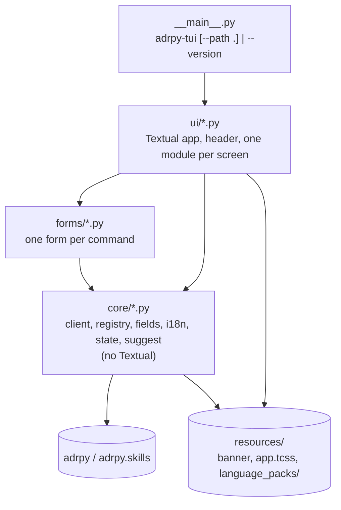

# Architecture

This page explains how `adrpy-tui` is put together and why. For the
per-command forms (which component edits which flag), see
[`forms.md`](forms.md); for the recorded decisions behind the choices
below, see [`doc/adr/`](adr/).

## Why this project exists

[`adrpy-ai`](https://github.com/FRACerqueira/adrpy-ai) is a JSON-only ADR
lifecycle CLI with no wizard, by design: every command is driven by flags
so it is safe to script and safe for an AI agent to call. `adrpy-tui` is
the missing human-friendly layer on top of it: a guided terminal UI that
**runs every change through the adrpy CLI** and never reimplements a rule.

## Boundaries

1. **The CLI is the only way in.** Every read and every change is an
   `adrpy` (or `adrpy-skills`) invocation whose stdout JSON is parsed. The
   TUI never writes a decision file, a config file or a decision-log entry
   itself. Reading a decision's `.md` to display it is allowed.
2. **Decide on `code` and `data`, never on `detail`.** `detail` is shown to
   the person; it is never parsed. The CLI's failure code is always the
   final word, even where the TUI pre-validates a field for convenience.
3. **One call at a time.** Calls run in a Textual worker so the UI stays
   responsive, but never two at once -- adrpy's own single-owner model
   (adrpy-ai ADR001V01) applies to the TUI as well.
4. **Decide on canonical status, display the repository's labels.**
   `explore` reports status canonically (`Proposed`, `Accepted`,
   `Rejected`, `Superseded`) whatever labels the repository configures
   (adrpy-ai ADR004V02's hidden marker); eligibility compares against those
   canonical values, and the labels read from `adrpy config` (`statusnew`,
   `statusacc`, ...) are used for display only.

## Invocation

`adrpy-ai` is a declared dependency, invoked from the TUI's own interpreter
so the TUI always talks to the adrpy installed next to it:

```
[sys.executable, "-m", "adrpy",        <verb>, *flags]
[sys.executable, "-m", "adrpy.skills", <verb>, *flags]
```

`adrpy-ai` is not on PyPI yet, so `adrpy-tui` cannot be published either
until it is; CI installs `adrpy-ai` from git first.

## Module map

The layout follows adrpy-ai's: a thin entry point, one module per command,
and shared modules in `core/` that never import the layers above them.



| Module | Concern |
|---|---|
| `core/client.py` | The only module that runs a subprocess; returns `Result(success, data, code, detail, warnings, exit_code)`. A stdout that is not one JSON object is a contract violation, reported as such. |
| `core/registry.py` | Maps each command to its form module (as adrpy-ai's `core/registry.py` maps verbs to `cli/` modules) and lays out the menus. |
| `forms/<command>.py` | One per command: the fields, their component, choices, ranges, conditions and suggestion sources. Choices and ranges live here because `adrpy help` exposes them only as prose (ADR004V01). |
| `core/fields.py` | Field checks before running and the translation of values into flags. |
| `core/i18n.py` | The language packs, the language list and the operating system's language (ADR005V01). |
| `core/state.py` | Per-user state: the chosen language and the last item selected in each menu, in `%APPDATA%\adrpy-tui\state.json` on Windows, `$XDG_STATE_HOME/adrpy-tui` or `~/.local/state/adrpy-tui` elsewhere. A remembered item that is disabled in the current repository is ignored. |
| `core/suggest.py` | Suggestions from the values a repository already uses. |
| `ui/*.py` | The Textual app and one module per screen, each under the same header. |

## Languages

Every text the TUI itself shows comes from
`resources/language_packs/<language>.json`, one pack per language adrpy
supports, `en-us` being the reference. The first run starts with the
language choice; the main menu's "Language" item changes it later. adrpy's
own responses (`detail`, `help` descriptions, codes) are shown as adrpy
sends them, in English (ADR005V01).

## Keeping specs honest

Hand-written forms and packs can drift from the CLI, so tests guard them:

- **Drift test:** every form is compared with `adrpy help --full` /
  `adrpy-skills help --full` -- same flag names, same `required`, no flag
  missing or extra.
- **Coverage test:** every command either `help` lists is reachable from
  the menu; a command whose form is not written yet is listed explicitly
  and shown disabled.
- **Language test:** every pack has exactly `en-us`'s keys, and the packs
  are the languages `adrpy help init` lists.

## Testing

- `client.py` with an injected fake runner.
- Integration against the real `adrpy` on repositories built in `tmp_path`.
- UI through Textual's `App.run_test()`, driven with `asyncio.run` (no
  `pytest-asyncio`).
