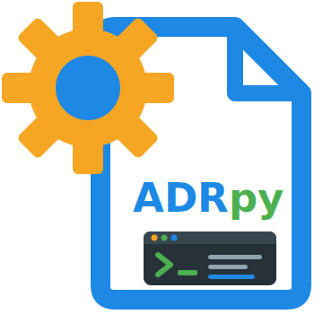

[← README](../README.md) · **Screens and forms** · [Architecture](architecture.md) · [Manual test checklist](manual-test-checklist.md) · [Decisions](adr/INDEX.md)

# Screens and forms

How adrpy-tui looks and behaves -- the header, the menus, lists, focus,
keys, previews and colors every screen shares -- and how every `adrpy` and
`adrpy-skills` command is reached and filled in, with the Textual 8 widget
used for each kind of input. How it is built is in
[Architecture](architecture.md). Where Textual has no
ready-made component, the closest core widget is used rather than a custom
one or a new dependency, so the experience can be validated first
([ADR0002V01](adr/ADR0002V01R01-textual-is-the-tui-framework,-a-deliberate-runtime-dependency-unlike-adrpy-ai.md)).

## Header

Every screen extends one base screen that renders the same header;
modals open over it, so it stays visible.

```
══════════════════════════════════════
    _    ____  ____       ______   __
   / \  |  _ \|  _ \     |  _ \ \ / /
  / _ \ | | | | |_) |____| |_) \ V /
 / ___ \| |_| |  _ <_____|  __/ | |
/_/   \_\____/|_| \_\    |_|    |_|
══════════════════════════════════════
Welcome to adrpy-tui (<version>) · adrpy-ai <version>
Repository: <repository root>
'<command>' command started
```

The banner is FIGlet *standard* text stored in the source (no FIGlet
dependency), between two double rules.

## Colors

Every color is a role, a Textual theme variable (`$tui-*`) set by the
appearance preset chosen in the main menu's "Appearance" item
(`core/themes.py`): **Default** (dark, the palette below), **Light** (a
light theme with dark text) and **High contrast**. Highlighting a preset
previews it; Enter keeps it, Back or `Esc` restores the saved one. The
choice is stored with the language; an unknown stored name is the default.
Every text role of every preset meets WCAG AA contrast (4.5:1) on its
theme's background (`tests/test_themes.py`), and so does text drawn on a
widget's own background -- the highlighted item, a typed value, the command to
confirm and the buttons -- measured on the rendered screen
(`tests/test_ui.py`). The highlighted item of menus and tables is the two
cursor roles inverted: its whole row in `tui-highlight` with its text in
`tui-cursor`, so it stands apart from the other rows at 3:1 or more, not by
its text color alone; out of focus, the theme's text on `tui-cursor`; under
the mouse, underlined. The headings and table headers of a command's help
and of a preview are the theme's text in bold, not Textual's primary color
-- a button's background, too dark as text on a dark screen. So is every
other color Textual draws that no preset sets for it: a placeholder, a
disabled option (a group's title, a decision the command cannot take)
and a select's arrow read at 4.5:1, an unchecked radio button or checkbox
and the focused widget's border -- in the highlight role -- at WCAG's 3:1
for a component. `tests/test_ui.py` measures everything drawn on every
screen, in every preset; a field's or a button's edges and the scrollbars
are decoration no state depends on, and are not measured. Default is the default
because it already does while keeping each kind of text distinct, and High
contrast is one choice away. Textual honors `NO_COLOR`. "Customize colors" sets any role's own color
(`#RRGGBB` or a CSS name) on top of the chosen preset, shown at once and
kept with the language; a color below 4.5:1 on its background is warned
about, not refused; "Back to the preset" and "Restore every color" undo
them. A saved color that can't be read is ignored and named on the main
menu.

The Default preset:

| Role | Color |
|---|---|
| Banner, command started/finished | darkorange `#FF8C00` |
| Info, key footer | grey `#808080` |
| Warnings | gold `#FFD700` |
| Summary, confirmation | navajowhite `#FFDEAD` |
| Help | skyblue `#87CEEB` |
| Error | red `#FF0000` |
| Result | white `#FFFFFF` |
| Typed value | cyan `#00FFFF` (approximate, to validate) |
| Highlighted item | green `#00FF00` on `#303030` |
| Buttons | white on `#00509E` |

## Lists

Every list of the interface -- menus, submenus, language, appearance, the
decision picker, and the tables to come (explore, check) -- shows eight
rows at a time (`ui/paged.py`, `PagedList`). Once a list holds more than
eight, the line below it tells where the cursor is: "Items 9–16 of 20 ·
page 2 of 3 · PgUp/PgDn"; a list that fits one page has no such line.
`PgUp`/`PgDn` move a page, `Home`/`End` to either end, and a list opens
on its first item or on the one remembered, whatever its page.
`tests/test_ui.py` checks that every list a screen shows is paged. The one exception is a field's short, fixed list of choices (the providers and skills of the skills forms, four and three): never more than a page, it is a `SelectionList` capped at eight rows rather than a `PagedList`.

## Focus

A screen opens with the focus where the keys act: a list screen on its
list (the arrows move it) or on the filter above it (typing filters, and
the arrows, `PgUp` and `PgDn` still move the list), a form on its first
field. Only a screen of text to read -- a command's help, a preview --
gives it to the scrolling body, for the arrows to scroll. Content that
arrives after the screen opened (an adrpy read) takes the focus once it
is laid out (`AdrpyScreen.focus_first`). `tests/test_ui.py` opens every
screen and checks it.

## Keys

Three actions have a key that can be changed, in the main menu's "Keys"
(`core/keys.py`, `ui/keys.py`): **run the screen's action** (`Ctrl+R`: run
a form, save a config, migrate, use a folder -- one action, so one key for
all four), **preview** (`F3`, as file managers' "view") and **show all /
only the available ones** (`F2`, in the decision picker). Enter waits for
the new key; one that another action has, or that every screen relies on,
is refused with the reason; Backspace and "Restore every key" go back to the
defaults. The keys are kept with the language; a saved key that can't be
used is ignored and named on the main menu. Esc, Enter, Tab, the arrows,
`PgUp`/`PgDn`/`Home`/`End`, and Textual's own `Ctrl+C`/`Ctrl+Q`/`Ctrl+P`
never change. The key line under every screen is built from the keys in
use, so it always names the key that works.

## Previews

The preview key opens the rendered content of the decision or log entry
under the cursor, from every list of them: explore and a decision's detail,
the decision picker (before choosing), check's errors, a command's result
(the file it wrote), migrate's files, and the decision-log browser. A link
to another `.md`, relative to the file, opens that file's preview; `Esc`
goes back, as a browser does. A link to anything else is only named, never
opened in a browser: the file may not be the person's own. A link opens only
a `.md` inside the repository: an absolute or network path (`//host/share`),
or one leading outside it, is named and refused before the file system is
touched ([ADR0006V02](adr/ADR0006V02R02-a-read-from-adrpy-that-hangs-is-stopped,-a-write-never-is,-and-a-link-in-a-file-opens-only-a-file-inside-the-repository.md)). The same holds for every preview,
whoever names the file -- a link, adrpy, a command's result -- and for the
decisions and log folders the configuration names: nothing outside the
repository opens, and no folder link (a symlink, a Windows junction) inside
it is followed; each folder on the way is looked at, never resolved, since
resolving opens the target. The decisions and log listings skip a folder
link, and a folder they cannot read, instead of looping or failing -- a
folder link being a symlink, a junction or a WSL symlink; any other reparse
point (a OneDrive placeholder, a deduplicated file) is the file itself; a
decision's detail reads its file through the same checks. A command's help names its links too. A file
longer than `PREVIEW_LINES` (500, `ui/preview.py`) shows its first 500
lines, and one past `PREVIEW_CHARACTERS` (100 000) its first characters,
with a line saying so and naming the whole file: rendering costs about 5.5
ms a line (500 lines: 2 to 3 s) and 2 s a megabyte. Only that start is read,
whatever the file's size.

## Text from files and adrpy

Nothing the TUI did not write -- file and folder names, a decision's links,
adrpy's answers -- is read as markup, so `[b]` or `[/x]` in a name shows
as it is. No control character reaches the terminal (`core/text.py`). A
name, a path or a command line also shows the characters that change how
the rest of a line reads without showing themselves -- a bidirectional
override, a zero-width one -- as `<U+202E>` and the like, so
`abc<U+202E>dm.txt` is not read as `abctxt.md`; a decision's own text keeps
them. A lone surrogate -- a name that is not valid UTF-8 -- is shown as
`<U+D800>` in a name and as U+FFFD in a decision's text: written to the
terminal as it is, it cannot be encoded and would stop the screen drawing. `tests/test_untrusted_text.py` drives every screen with such names.

Every text field keeps only what can be read as it is (`field_text`,
`ui/inputs.py`): whatever is typed, pasted, or filled in -- a suggestion, a
decision's scope, a value of the configuration -- drops control characters,
the bidirectional controls (embeddings, overrides, isolates and marks, which
reorder what is drawn even inside the field), the tag characters (U+E0000
to U+E007F, text nobody sees -- words smuggled into a decision an AI agent
reads later), the line and paragraph
separators and lone surrogates; a multi-line field keeps its line breaks and
tabs. The other invisible characters are part of a language's text -- the
ZWNJ of a Persian word, the ZWJ of an emoji, a BOM -- and stay: the
confirmation writes them out as `<U+200C>` and the like, so what it shows is
what runs. A value that keeps CRLF line endings, which cannot be drawn, is
said so below the command line. A value shown in a field and left as it was
is no change: a configuration value or the repository path whose field
dropped a bidirectional control keeps its own. The date field is left out:
its mask takes digits only. A field of adrpy's answer of another type than
expected -- an error's code as a number, a folder as a list, a decision's
header that is not an object -- is read as text or as its default, never the
end of the screen; a decision whose name or path is not text is left out of
every list (`decisions.listed`).

## Components

| Input | Used for | Textual |
|---|---|---|
| Menu | menus | `OptionList` (disabled items), description panel below |
| Decision choice | choosing a decision | `AdrPicker`: a filter `Input` by name (`Enter` moves to the list) over an `OptionList` of the decisions with the repository's label for their state, paged like every list (see "Lists"); a `Switch`, on by default, lists only the ones the command can take, and off lists them all with the others disabled -- `F2` flips it from any field, and a line says what it hides ("3 of 49 decisions (only the available ones · F2 shows all)"); the choice is shown below |
| Enum | separator, casetransform, language, log enums | `Select` |
| Validated text | titles, labels, prefix | `Input(max_length, restrict, validators)` |
| Text with suggestions | scope, domain | `Input` whose inline suggestion continues what was typed (prefix match, `→` accepts it), plus a line below listing existing values that contain the text or look like it (`difflib`) |
| Small integer range | lenseq/lenversion/lenrevision | `Select` over the allowed range |
| Date | refdate | `MaskedInput` `9999-99-99`, defaults to today |
| On/off | `--empty`, booleans | `Switch` |
| Several of a list | explore columns, migrate list | `SelectionList` |
| Rows with columns | explore | `PagedList` rows whose columns are padded by terminal cells (a CJK label takes two), the last never cut, under a header line; a filter `Input`; below the list, the highlighted row's values whole (explore) or the entry's whole file name and folder (the log browser), since every other column is cut to its width |
| Errors | check, a failed command | `ErrorList`: a `PagedList` row per error (file · code), the highlighted one's detail, hint and related files below, in adrpy's words -- a hint is too long for a table cell |
| Folder or file | repository, `--seed` | `DirectoryTree` filtered |
| Confirmation | every change | modal showing the exact command line about to run |
| Progress | reads | `LoadingIndicator` |
| Decision content | detail view, previews, help | `Markdown`, read-only, links never opened in a browser |

## Menus

```
Main menu
├─ Decisions             new · approve · reject · undo · version · revise · supersede
├─ Explore and validate  explore (table → detail) · check
├─ Decision log          log · browse the entries
├─ Repository            init · config · migrate
├─ Install config        installconfig
├─ AI skills             list · install · remove
├─ Command help          one item per adrpy and adrpy-skills command
├─ Change repository
├─ Language
├─ Appearance
├─ Keys
└─ Exit
```

- The first run starts with the language choice (ADR0005V01): the eleven
  languages adrpy supports, each by its own name, the operating system's
  language preselected when it is one of them. "Language" changes it later,
  from the same list with "← Back" on top and the current language
  highlighted; the first run has no Back, since there is no menu yet.
- With no repository configured (`config-not-found`), Decisions, Explore and validate, Decision log and
  `config`/`migrate` are disabled.
- Every submenu starts with "← Back"; `Esc` also goes back one level. A
  submenu opens on its first command, or on the item last selected in it;
  choosing Back is not remembered. A grey line under each screen lists its
  keys.
- The last selected item of each menu is remembered across sessions.
- The main menu names what it found at start-up and set aside: an adrpy-ai
  outside the range this adrpy-tui was validated with (ADR0003V01), a
  repository configuration that could not be read (with the advice to
  repair `.adrpy.json` by hand when adrpy refused its content), the
  warnings reading it raised, a saved key or
  color that could not be used.
- The repository is chosen once, shown in the header and changed from the
  menu, rather than asked for in every command.
- "Change repository" takes a folder's path, typed or chosen in a tree of
  folders starting above the current repository; the folder must exist and
  need not be initialized. The whole interface then works on it.

## Per-command forms

Eligibility compares against the canonical status `explore` reports
(`Proposed`, `Accepted`, `Rejected`); the repository's own labels from
`adrpy config` are only displayed. `refdate` is never after today and,
where the command says so, never before the decision's own relevant date
from `explore`.

A required field is marked `*`. Ctrl+R with one empty or not valid runs
nothing: the field's message shows under it, the focus moves there, and a
notification names the first such field and why (`form.not_run`), seen even
when the field's message is off screen. A
decision list takes its rows from the room left on screen: in a terminal
shorter than about 40 rows they can all be squeezed out (README, Terminal
requirements).

| Command | Fields → component |
|---|---|
| `new` | title `Input` (required; no `\|<>:"/\?*`) · domain, scope `Input` + suggestions from `explore` · refdate |
| `approve`, `reject` | `AdrPicker` (`Proposed`, or a migrated placeholder) · refdate, not before the decision's creation |
| `undo` | `AdrPicker` (`Accepted`/`Rejected`) |
| `version` | `AdrPicker` (`Accepted`/`Rejected`, or a migrated placeholder) · domain, scope filled from the chosen decision (a value typed before choosing is kept) · refdate, not before its last update (or creation) · `--empty` `Switch` |
| `revise` | `AdrPicker` (`Accepted`/`Rejected`, or a migrated placeholder) · refdate, not before its last update (or creation); a repository with revisions off gets adrpy's own `revision-not-configured` |
| `supersede` | `AdrPicker` (`Accepted`, or a migrated placeholder) · title left empty for adrpy's default, shown as the placeholder · domain, scope filled from the chosen decision · refdate, not before its last update (or creation) |
| `explore` | its own screen: File, Folder (relative to the decisions folder, `.` straight in it: adrpy finds decisions in subfolders too), Status (the repository's label), Scope, Domain for every decision, a folder `Select` and a filter by name or folder, with "12 of 49 decisions" below, and a warning when the repository has inconsistencies; `Enter` opens the detail: the header fields, the actions its state allows (each opens its form with the decision chosen) and the file's content, without control characters. Both read the repository again when they come back to the top |
| `check` | its own screen, run as it opens and again when it comes back to the top: "No inconsistencies in N decisions", or the `ErrorList` |
| `init` | the current repository only (another folder goes through "Change repository") · the config's source, a `RadioSet`: adrpy's defaults in a language (a `Select`, preselected with the UI language), the default (the install-level config, or English when there is none), or a config file (a path, required and existing while chosen); only the chosen source's field is shown and sent. On an initialized repository a warning says a config file replaces it and the other sources are refused. Once it succeeds the repository is read again and the menus rebuilt |
| `config` | a list of the fields in groups (folders, names, status labels, header labels, template, migration), each with its current value; `Enter` edits one with the editor of its type (enum → `Select`, integer → `Select` over its range, template → `TextArea`, text → `Input`); changed fields are marked, and saving runs one `config` with only them. Fields adrpy guards once decisions exist say so in their description; adrpy's refusal stays the final word |
| `installconfig` | the same editor, with no `--path`; while this machine has no install-level config, it offers to create one first, from a language pack or a config file. Its tests use a fake client only: the real adrpy would write the machine's own install-level config |
| `migrate` | a guided builder: (1) every `.md` without a valid header in the folder and its subfolders (the root `INDEX.md` aside), one of them the sample -- the preview then shows which of them the pattern reads; (2) on a sample file name, the position and length of each part (number, title, optional version, revision, prefix) chosen one by one, each showing what it reads from the sample; (3) a preview of what the pattern reads from every file, through `explore --migrationpattern`; (4) confirm the two commands, `config --migrationpattern` then `migrate` |
| `log` (browse) | its own screen: every entry under the decision-log folder (subfolders too; the log's own `INDEX.md` and `CYCLES.md` left out), Date, Classification, Scope, Slug read from its name, a classification `Select` and a filter, with "3 of 12 entries" below; `Enter` or the preview key opens the entry rendered |
| `log` | classification, severity and resolution `Select` (adrpy's own vocabulary, as is) · scope, slug `Input` that only take kebab-case · summary · body `TextArea` · refdate · front, severity, resolution, round (digits only, empty for the next one) shown only for `audit-finding`/`doc-drift`, reopenwhen only for `deferred`; front and reopenwhen are required while shown |
| `skills list` | its own screen: skill, provider, scope, state (installed, not installed, changed by hand) and file of every row adrpy-skills reports, in the paged list |
| `skills install`, `skills remove` | providers and skills, each a `SelectionList` sent comma-separated (nothing chosen: all, adrpy-skills' default) · where, a `RadioSet`: this repository or my user folder (claude only) · force, allow external links `Switch`. Tests only send `global` to a fake client: the real adrpy-skills would write to the user's own home |
| `help` | description, arguments table and failure codes table, in the help color |

## Running a command

The confirmation shows every command line, a value holding a line break
quoted, in a box that scrolls with the keys a list uses while Yes keeps the
focus. While a command runs, nothing leaves its screen -- the preview and
show-all keys do nothing, and Textual's command palette (Ctrl+P) is off --
and its result replaces that screen. A write is never stopped: past the time
a read may take (60 s, `READ_TIMEOUT` in `core/client.py`), the screen says
adrpy is still running and its result unknown, and offers to leave; the
result then says so, with Check at hand. A read that does not answer in that
time is stopped and shown as `tui-timeout` ([ADR0006V02](adr/ADR0006V02R02-a-read-from-adrpy-that-hangs-is-stopped,-a-write-never-is,-and-a-link-in-a-file-opens-only-a-file-inside-the-repository.md)). While a
write that was left still runs, another write is refused
(`tui-write-still-running`) -- two adrpy writes on one working copy are a
usage error for adrpy-ai -- and reads, Check first, still run; the refusal
offers Check, and Check, when that write ran as it began to read, says above its result that
what it shows may be the repository half-way through it, and to run it again
once it has ended. A write still waiting for adrpy (a hung read ahead of it)
can be left before it starts (`tui-not-started`). Quitting never waits, a
crash included: a read in flight is stopped (`tui-stopped`), a write left. A
failure of the TUI itself is shown on the screen where it happened, never
the end of the app, and its traceback goes to `error.log`, next to the state
file -- the note says so when it could not be written.

Every key, choice, button or link acts only from the screen in front
(`on_top`, `ui/base.py`): keys typed while the app was busy reach it all at
once, and one meant for a screen that closed meanwhile must not close or
open another. `tests/test_textual_names.py` checks every such handler.

Back on a decision's detail, it reads the decision again -- a command run
from there may have changed it -- and offers no action until it answers; a
decision renamed or deleted meanwhile is said to be gone.

## Result screen

Success shows what adrpy did in the result color and any `warnings` in the
warning color; failure shows `detail` in the error color and, when present,
`data.errors` in the `ErrorList` with its repair hints, and the rest of
`data` (the files a count in the detail is about), a list item by item
and a record field by field. The preview key opens the file the command
wrote, the highlighted error's file, or a file a failure names by its
name only, where adrpy looked.
`Esc` goes back to where the form was opened from -- after a successful
`init`, `config` or `migrate`, which change what the menus offer, to the
main menu, rebuilt once the repository is read again.

---

[← README](../README.md) · **Screens and forms** · [Architecture](architecture.md) · [Manual test checklist](manual-test-checklist.md) · [Decisions](adr/INDEX.md)
